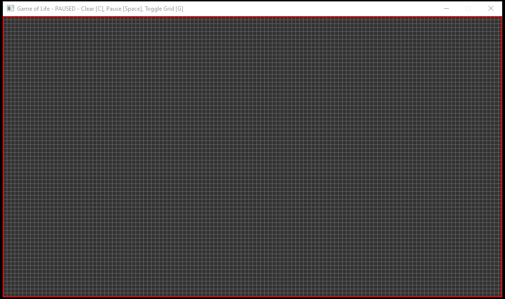

# Simple Game of Life
A simple implementation of Conway's Game of Life in C#. Uses [SFML](https://www.sfml-dev.org/) via my [PixelWindow](https://github.com/Jallenbah/pixelwindow) system for easy per-pixel rendering.

To run, simply clone the repo and run the solution in VS 2022. There should be no additional steps if you have the required VS components for C# development and have your VS set up to automatically fetch Nuget dependencies (needed for SFML)